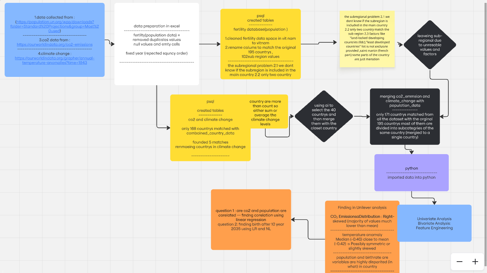

# project-human-population-prediction
This project involves data collection, preprocessing, analysis, and modeling to explore relationships between population, CO2 emissions, and climate change. Below is a concise summary of the process

---

## 🌍 Population & Climate Change Analysis

This project explores the relationships between population growth, CO₂ emissions, and climate change through data collection, preprocessing, analysis, and modeling.

---

### 📥 1. Data Collection

- **Sources:**
  - **Population:** [UN Population Projections](https://population.un.org/wpp/downloads/)
  - **CO2 Emissions:** [Our World in Data](https://ourworldindata.org/co2-emissions)
  - **Climate Change:** [Annual Temperature Anomalies](https://ourworldindata.org/grapher/annual-temperature-anomalies?time=1943)

---

### 🛠️ 2. Data Preparation

#### **Population Data**
- Cleaned using Excel:
  - Removed duplicates, null values, and empty cells.
  - Fixed year format (repeated sequence corrected).
- Processed in PostgreSQL:
  - Created tables for fertility and population.
  - Standardized Vietnam's data.
  - Addressed subregional inconsistencies.

#### **CO2 Emissions & Climate Data**
- Cleaned and matched country names across datasets.
- Merged 168 countries into a unified list.
- Resolved naming conflicts in climate change dataset.

---

### 🔗 3. Data Integration

- Combined CO₂ emissions and temperature anomaly data with population metrics.
- Selected 40 countries using AI-driven criteria and matched them with global data.
- Out of 195 countries, only 171 were successfully matched — others were split into subcategories or merged.

---

### 🔍 4. Data Analysis

#### **Univariate Analysis**
- Examined variable distributions:
  - **CO2 Emissions:** Right-skewed (most values below mean).
  - **Temperature Anomaly:** Nearly normal (median close to mean).
  - **Population & Birthrate:** Highly variable across countries.

#### **Bivariate Analysis**
- Investigated correlations:
  - Between CO₂ emissions and population size.
  - Predicted birthrate trends for 2035 using:
    - Linear Regression
    - Neural Networks

---

### 🧠 5. Feature Engineering

- Engineered new features to improve model accuracy and interpretability.

---

### 📊 6. Modeling

- **Regression Models:**
  - Analyzed correlation between CO₂ emissions and population.
  - Forecasted birthrates for 2035 using:
    - **Linear Regression (LR)**
    - **Neural Networks (NN)**
